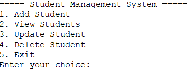
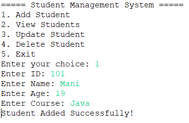
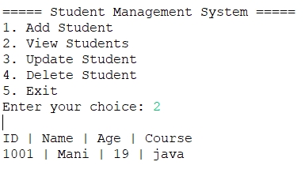
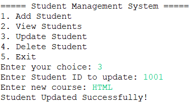
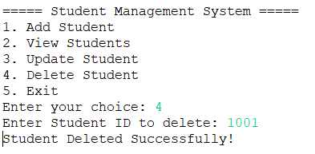
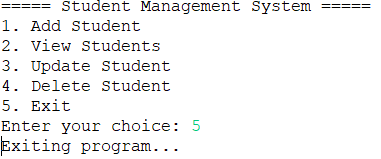

# Student Management System

A **menu-driven CRUD application** built with **Java**, **JDBC**, and **MySQL**, designed to manage student records. This is a console-based project suitable for beginners learning **Java Full Stack Development**.

---

## 🔹 Features

* Add a new student record
* View all student records
* Update student information (course)
* Delete a student record
* Exit the program

All data is stored in a **MySQL database**.

---

## 🔹 Technologies Used

* **Java** (Core Java, Scanner, JDBC)
* **MySQL** (Database)
* **Eclipse IDE** (Development)
* **Git & GitHub** (Version control)

---

## 🔹 Database Setup

Create the database and table in MySQL:

```sql
CREATE DATABASE studentdb;

USE studentdb;

CREATE TABLE students(
    id INT PRIMARY KEY,
    name VARCHAR(50),
    age INT,
    course VARCHAR(50)
);
```

---

## 🔹 Application Menu



---

## 🔹 Add Student



---

## 🔹 View Students



---

## 🔹 Update Student



---

## 🔹 Delete Student



---

## 🔹 Exit Program



---

## 🔹 How to Run

1. Clone the repository

```
git clone https://github.com/thisismanikanta/student-management-system.git
```

2. Import the project into **Eclipse IDE**

3. Create the database and table using the SQL script above

4. Update **database username and password** in the Java code

5. Run the program
